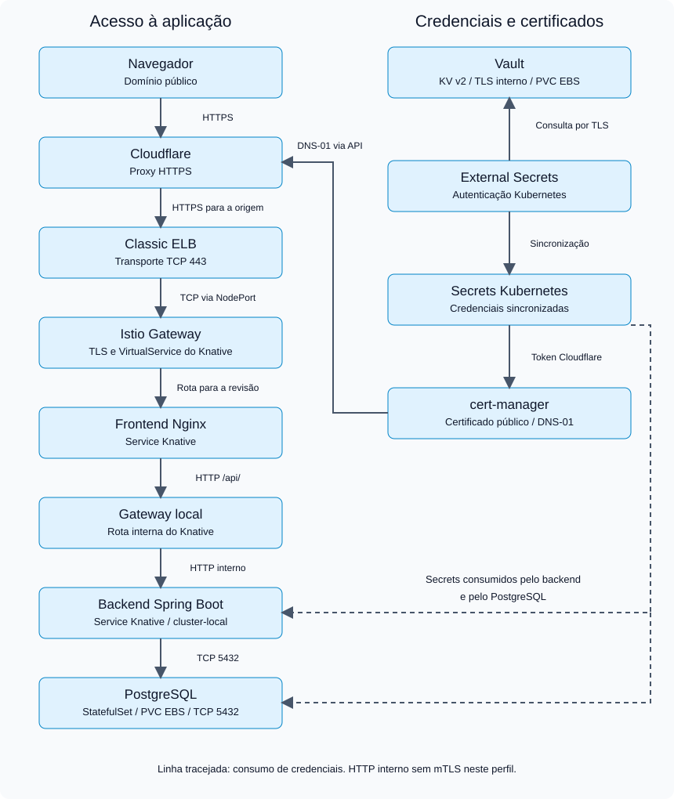

# Banco SRJM — instalação Helm no EKS

Frontend Nginx e backend Spring Boot executam como Services Knative. PostgreSQL usa StatefulSet e EBS. O acesso segue **Cloudflare → Classic ELB → Istio → frontend → backend → PostgreSQL**. Vault armazena credenciais; External Secrets sincroniza os Secrets Kubernetes.



## Índice

1. [Pré-requisitos e parâmetros](#parametros)
2. [Armazenamento e controller AWS](#aws)
3. [cert-manager, Istio e Knative](#plataforma)
4. [Vault e External Secrets](#vault)
5. [Let’s Encrypt e DNS-01](#tls)
6. [Instalar banco, backend e frontend](#app)
7. [Cloudflare e validação](#validacao)
8. [Argo CD e documentação](#documentacao)

<a id="parametros"></a>
## 1. Pré-requisitos e parâmetros

Roteiro para **instalação nova**, executado na raiz do repositório com Bash, AWS CLI v2, kubectl, Helm, Vault CLI, jq e curl. Não requer Python.

O EKS, nodes EC2, rede e roles IAM devem existir. São necessários acesso administrativo Kubernetes, EBS CSI com permissões e token Cloudflare com `Zone:DNS:Edit` e `Zone:Zone:Read` na zona do domínio. Os comandos não criam EKS, VPC ou IAM.

Informe os parâmetros uma vez e mantenha esta sessão aberta:

```bash
bash
set +x
set -o pipefail
read -r -p "Nome do cluster EKS: " CLUSTER_NAME
read -r -p "Região AWS: " AWS_REGION
read -r -p "Domínio completo da aplicação: " APP_DOMAIN
read -r -p "E-mail Let's Encrypt: " ACME_EMAIL
read -r -p "ARN da role IAM do Load Balancer Controller: " AWS_LBC_ROLE_ARN
export CLUSTER_NAME AWS_REGION APP_DOMAIN ACME_EMAIL AWS_LBC_ROLE_ARN
export KUBE_CONTEXT="$CLUSTER_NAME"
export APP_NAMESPACE="banco-srjm"
export CHART_VERSION="1.0.0"
export HELM_REPO_URL="https://srjm23.github.io/Banco-srjm-k8s/"
aws eks update-kubeconfig --name "$CLUSTER_NAME" --region "$AWS_REGION" --alias "$KUBE_CONTEXT"
export VPC_ID="$(aws eks describe-cluster --name "$CLUSTER_NAME" --region "$AWS_REGION" --query 'cluster.resourcesVpcConfig.vpcId' --output text)"
kubectl --context "$KUBE_CONTEXT" get nodes
helm --kube-context "$KUBE_CONTEXT" list -A
kubectl --context "$KUBE_CONTEXT" apply -f k8s/namespace.yaml
```

Exemplo de domínio: `bancosrjm.geradorqrcode-srjm.uk`. O namespace permanece `banco-srjm` porque os stores e as políticas Vault restringem acesso a ele. As versões fixadas reproduzem o ambiente documentado; confira compatibilidade ao usar outro EKS.

Cadastre os repositórios:

```bash
helm repo add eks https://aws.github.io/eks-charts
helm repo add jetstack https://charts.jetstack.io
helm repo add istio https://istio-release.storage.googleapis.com/charts
helm repo add knative-operator https://knative.github.io/operator
helm repo add hashicorp https://helm.releases.hashicorp.com
helm repo add external-secrets https://charts.external-secrets.io
helm repo update
```

<a id="aws"></a>
## 2. Armazenamento e controller AWS

Confira se o EBS CSI já existe. Se estiver ausente, instale o add-on com uma role previamente configurada conforme o [guia AWS](https://docs.aws.amazon.com/eks/latest/userguide/ebs-csi.html):

```bash
kubectl --context "$KUBE_CONTEXT" -n kube-system get deployment ebs-csi-controller
```

Somente se ausente:

```bash
read -r -p "ARN da role IAM do EBS CSI: " EBS_CSI_ROLE_ARN
aws eks create-addon --cluster-name "$CLUSTER_NAME" --region "$AWS_REGION" \
  --addon-name aws-ebs-csi-driver --service-account-role-arn "$EBS_CSI_ROLE_ARN"
aws eks wait addon-active --cluster-name "$CLUSTER_NAME" --region "$AWS_REGION" --addon-name aws-ebs-csi-driver
```

Crie a StorageClass gp3 e instale o controller AWS:

```bash
kubectl --context "$KUBE_CONTEXT" apply -f k8s/storageclass.yaml
helm --kube-context "$KUBE_CONTEXT" upgrade --install aws-load-balancer-controller eks/aws-load-balancer-controller \
  -n kube-system --version 3.5.0 \
  --set-string "clusterName=$CLUSTER_NAME" --set-string "region=$AWS_REGION" --set-string "vpcId=$VPC_ID" \
  --set serviceAccount.create=true --set serviceAccount.name=aws-load-balancer-controller \
  --set-string "serviceAccount.annotations.eks\\.amazonaws\\.com/role-arn=$AWS_LBC_ROLE_ARN" \
  -f helm/values-aws-load-balancer-controller-classic.yaml --wait --timeout 5m
```

**Classic ELB:** quem o cria é o provedor AWS legado de Services, não o Load Balancer Controller. O webhook de atribuição automática é desabilitado nos values. O Service público será aplicado na próxima etapa, sem classe NLB e com descoberta automática de subnets elegíveis. Esse comportamento exige suporte legado no cluster; não é garantido em qualquer EKS/Auto Mode. [Detalhes](docs/istio-aws-classic.md).

<a id="plataforma"></a>
## 3. cert-manager, Istio e Knative

Instale nesta ordem: CRDs/controladores, gateway e configuração Knative.

```bash
helm --kube-context "$KUBE_CONTEXT" upgrade --install cert-manager jetstack/cert-manager \
  -n cert-manager --create-namespace --version v1.21.1 --set crds.enabled=true --wait
helm --kube-context "$KUBE_CONTEXT" upgrade --install istio-base istio/base \
  -n istio-system --create-namespace --version 1.31.0 --wait
helm --kube-context "$KUBE_CONTEXT" upgrade --install istiod istio/istiod \
  -n istio-system --version 1.31.0 -f helm/values-istiod-eks.yaml --wait
helm --kube-context "$KUBE_CONTEXT" upgrade --install istio-ingress istio/gateway \
  -n istio-ingress --create-namespace --version 1.31.0 -f helm/values-istio-gateway-eks.yaml --wait
helm --kube-context "$KUBE_CONTEXT" upgrade --install knative-operator knative-operator/knative-operator \
  -n knative-operator --create-namespace --version 1.23.1 --wait
kubectl --context "$KUBE_CONTEXT" create namespace knative-serving --dry-run=client -o yaml | kubectl --context "$KUBE_CONTEXT" apply -f -
kubectl --context "$KUBE_CONTEXT" apply -k k8s/platform
kubectl --context "$KUBE_CONTEXT" -n knative-serving wait \
  --for=condition=Ready knativeserving/knative-serving --timeout=600s
```

O Operator instala Serving e net-istio. O gateway do chart é ClusterIP; `istio-ingress-classic` fornece a exposição pública. Knative gera as rotas Istio e as revisões. Não instale Deployments/VirtualServices paralelos para frontend/backend.

<a id="vault"></a>
## 4. Vault e External Secrets

Instale certificados internos, ESO e Vault:

```bash
kubectl --context "$KUBE_CONTEXT" apply -k k8s/vault
kubectl --context "$KUBE_CONTEXT" -n vault wait \
  --for=condition=Ready certificate/vault-ca certificate/vault-server --timeout=180s
helm --kube-context "$KUBE_CONTEXT" upgrade --install external-secrets external-secrets/external-secrets \
  -n external-secrets --create-namespace --version 2.10.0 -f helm/values-external-secrets.yaml --wait
helm --kube-context "$KUBE_CONTEXT" upgrade --install vault hashicorp/vault \
  -n vault --version 0.34.1 -f helm/values-vault-eks.yaml
kubectl --context "$KUBE_CONTEXT" -n vault wait \
  --for=jsonpath='{.status.phase}'=Running pod/vault-0 --timeout=300s
```

**Antes de continuar, execute a [configuração manual do Vault](docs/vault-cli.md)**: inicialização, unseal, políticas, ClusterSecretStores, credenciais da aplicação e token Cloudflare solicitado sem eco. Todos os comandos usam Vault CLI, kubectl e jq.

O Vault recém-instalado fica selado, por isso seu Helm não usa `--wait`. Este perfil tem uma réplica, PVC de 5 GiB e unseal manual. A configuração manual cria apenas os stores e o ExternalSecret Cloudflare; os ExternalSecrets da aplicação serão criados pelos charts, evitando conflito de ownership.

<a id="tls"></a>
## 5. Let’s Encrypt e DNS-01

Com o token sincronizado, declare o emissor usando os parâmetros informados. O token fica no Vault/Secret Kubernetes, nunca em values Helm.

```bash
jq -n --arg email "$ACME_EMAIL" --arg domain "$APP_DOMAIN" '
{
  apiVersion: "cert-manager.io/v1", kind: "ClusterIssuer",
  metadata: {name: "letsencrypt-production"},
  spec: {acme: {
    email: $email,
    server: "https://acme-v02.api.letsencrypt.org/directory",
    privateKeySecretRef: {name: "letsencrypt-production-account-key"},
    solvers: [{selector: {dnsNames: [$domain]}, dns01: {cloudflare: {
      apiTokenSecretRef: {name: "cloudflare-api-token-secret", key: "api-token"}
    }}}]
  }}
}' | kubectl --context "$KUBE_CONTEXT" apply -f -
kubectl --context "$KUBE_CONTEXT" wait --for=condition=Ready clusterissuer/letsencrypt-production --timeout=180s
```

O e-mail é da conta ACME; o solver Cloudflare autentica pelo token. O seletor atende o domínio informado; amplie-o se compartilhar o emissor com outros domínios. [DNS-01 Cloudflare](https://cert-manager.io/docs/configuration/acme/dns01/cloudflare/).

<a id="app"></a>
## 6. Instalar banco, backend e frontend

Os pacotes precisam estar publicados no GitHub Pages. Para publicar, consulte [Helm e publicação](helm/README.md). Instale os componentes sequencialmente; `helm --wait` não substitui a espera pelas CRDs Knative/ESO.

```bash
helm repo add banco-srjm "$HELM_REPO_URL"
helm repo update banco-srjm
helm search repo banco-srjm --versions
helm --kube-context "$KUBE_CONTEXT" upgrade --install banco banco-srjm/banco-srjm-banco \
  -n "$APP_NAMESPACE" --version "$CHART_VERSION" --wait --timeout 10m
kubectl --context "$KUBE_CONTEXT" -n "$APP_NAMESPACE" wait --for=condition=Ready externalsecret/postgres-secret --timeout=180s
kubectl --context "$KUBE_CONTEXT" -n "$APP_NAMESPACE" rollout status statefulset/postgres --timeout=300s
helm --kube-context "$KUBE_CONTEXT" upgrade --install backend banco-srjm/banco-srjm-backend \
  -n "$APP_NAMESPACE" --version "$CHART_VERSION" \
  --set-string "config.FRONTEND_URL=https://${APP_DOMAIN}/" --wait --timeout 10m
kubectl --context "$KUBE_CONTEXT" -n "$APP_NAMESPACE" wait --for=condition=Ready \
  externalsecret/backend-secret externalsecret/backend-application --timeout=180s
kubectl --context "$KUBE_CONTEXT" -n "$APP_NAMESPACE" wait --for=condition=Ready ksvc/backend --timeout=600s
helm --kube-context "$KUBE_CONTEXT" upgrade --install frontend banco-srjm/banco-srjm-frontend \
  -n "$APP_NAMESPACE" --version "$CHART_VERSION" \
  --set-string "domain.host=$APP_DOMAIN" --wait --timeout 10m
kubectl --context "$KUBE_CONTEXT" -n "$APP_NAMESPACE" wait --for=condition=Ready \
  ksvc/frontend certificate/banco-srjm "domainmapping/$APP_DOMAIN" --timeout=600s
```

O chart frontend cria Certificate e DomainMapping. O banco utiliza PVC de 20 GiB; o backend inclui Mailpit para e-mails de teste.

**Cluster existente:** recursos aplicados anteriormente por Kustomize/Argo precisam de adoção de ownership antes do Helm CLI. Não exclua PostgreSQL/PVC para resolver conflitos. Consulte [adoção e values](helm/README.md). Após escolher Helm ou Argo, não aplique os mesmos recursos com `kubectl apply -k k8s`.

<a id="validacao"></a>
## 7. Cloudflare e validação

Obtenha o hostname criado:

```bash
kubectl --context "$KUBE_CONTEXT" -n istio-ingress get svc istio-ingress-classic \
  -o jsonpath='{.status.loadBalancer.ingress[0].hostname}{"\n"}'
```

Na Cloudflare, crie o CNAME do domínio apontando para esse hostname, ative o proxy e configure **Full (strict)** quando o certificado estiver pronto. O token DNS-01 não cria o CNAME. O TLS da origem termina no Istio.

```bash
kubectl --context "$KUBE_CONTEXT" get clustersecretstores
kubectl --context "$KUBE_CONTEXT" -n "$APP_NAMESPACE" get ksvc,externalsecrets,certificate,domainmapping,pods,pvc
curl -I "https://${APP_DOMAIN}/"
curl -fsS "https://${APP_DOMAIN}/api/actuator/health"
```

Espere recursos Ready, PVC Bound e saúde `UP`. Secret atualizado não cria revisão Knative: altere `configVersion` no chart para recarregar variáveis. Alterar a senha no Secret não altera a senha do PostgreSQL já inicializado.

<a id="documentacao"></a>
## 8. Argo CD e documentação

Argo CD é opcional para Helm CLI. Se preferir GitOps, instale-o e use as [Applications](argocd/applications/) **no lugar das instalações da etapa 6**:

```bash
helm repo add argo https://argoproj.github.io/argo-helm
helm repo update argo
helm --kube-context "$KUBE_CONTEXT" upgrade --install argocd argo/argo-cd \
  -n argocd --create-namespace --version 10.8.2 --set server.service.type=ClusterIP --wait --timeout 10m
```

Antes de aplicá-las, configure `spec.source.helm.parameters`: `config.FRONTEND_URL=https://SEU_DOMINIO/` em backend e `domain.host=SEU_DOMINIO` em frontend. A origem usa `targetRevision` para a versão do chart; o destino padrão é o próprio cluster do Argo. Sincronize banco → backend → frontend, esperando cada componente ficar pronto.

- [Helm: values, publicação e Applications](helm/README.md).
- [Vault pela CLI, sem Python](docs/vault-cli.md).
- [Scripts Python: uso opcional e limitações](scripts/README.md).
- [Manifestos Kustomize preservados](k8s/README.md).
- [Guia didático em PDF](docs/guia-didatico-banco-srjm.pdf).
