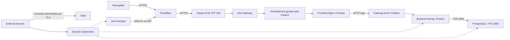

# Banco SRJM no EKS

Aplicação com frontend Nginx e backend Spring Boot gerenciados pelo **Knative**, PostgreSQL persistente em EBS e acesso público por **Cloudflare → Classic ELB → Istio Gateway**. As credenciais ficam no Vault e são entregues à aplicação pelo External Secrets Operator.

Há três charts Helm independentes: **banco, backend e frontend**, preparados para três Applications no Argo CD. Os manifestos de `k8s/` continuam disponíveis como alternativa Kustomize. A plataforma é instalada separadamente, antes dos charts da aplicação.

Este roteiro reproduz a configuração documentada do cluster `srjm-eks-new`, contexto `eks-new`, região `us-east-2`. As versões abaixo são as registradas na consulta de 11/09/2026; não representam uma nova verificação do cluster nem uma recomendação de versão mais recente. Os comandos são instruções de instalação, não um histórico literal de todos os comandos executados anteriormente.

## Índice

1. [Resumo da arquitetura](#arquitetura)
2. [Pré-requisitos e versões](#pre-requisitos)
3. [Preparação do ambiente](#preparacao)
4. [EBS CSI e armazenamento](#armazenamento)
5. [AWS Load Balancer Controller](#aws-controller)
6. [cert-manager](#cert-manager)
7. [Istio](#istio)
8. [Knative e Classic ELB](#knative)
9. [External Secrets e Vault](#vault)
10. [Credenciais e inicialização do Vault](#credenciais)
11. [Certificado público e Cloudflare](#cloudflare)
12. [Argo CD](#argocd)
13. [Publicar os charts Helm](#publicacao)
14. [Instalar a aplicação](#aplicacao)
15. [Verificação e operação](#operacao)
16. [Organização e documentação](#documentacao)

<a id="arquitetura"></a>
## 1. Resumo da arquitetura



- **Istio** recebe as conexões e aplica as rotas. O TLS da origem termina no gateway; o ELB transporta TCP.
- **Knative** cria revisões, escala frontend/backend e gera as rotas Istio por meio do net-istio. O `DomainMapping` associa o domínio ao frontend.
- **Frontend** entrega a interface e encaminha `/api/` para `backend.banco-srjm.svc.cluster.local`. O backend é interno, com visibilidade `cluster-local`.
- **PostgreSQL** é um StatefulSet com uma réplica e PVC de 20 GiB. Não é gerenciado pelo Knative. Mailpit recebe e-mails de teste internamente.
- **Vault + External Secrets** armazenam e sincronizam credenciais. A aplicação lê Secrets Kubernetes, sem consultar diretamente o Vault. Configurações comuns ficam em ConfigMaps.
- **cert-manager** emite e renova certificados. O token Cloudflare permite resolver o desafio DNS-01; não encaminha tráfego nem cria o CNAME neste projeto.

O injector do Istiod é mantido para o gateway. Frontend e backend têm injeção de sidecar Istio desabilitada; o `queue-proxy` presente nesses pods pertence ao Knative. O tráfego HTTP interno da aplicação não usa mTLS neste perfil.

<a id="pre-requisitos"></a>
## 2. Pré-requisitos e versões

Antes de instalar os componentes, tenha:

- Cluster EKS com nodes EC2 prontos, capacidade de CPU/memória e acesso à internet para baixar imagens.
- VPC, subnets, rotas e permissões AWS configuradas. Para o Classic público, subnets elegíveis com acesso ao Internet Gateway e suporte ao provedor AWS legado de Services. Nodes públicos, sozinhos, não garantem isso.
- Credenciais AWS e acesso Kubernetes para instalar CRDs, ClusterRoles e recursos de cluster.
- Roles IAM para AWS Load Balancer Controller e EBS CSI, com suas políticas e autenticação configuradas. Nos exemplos, utiliza-se IRSA/OIDC.
- Domínio gerenciado na Cloudflare e token restrito à zona, com permissões `Zone:DNS:Edit` e `Zone:Zone:Read` para DNS-01.
- Credenciais iniciais da aplicação e arquivo Spring `application.yaml` mantidos fora do Git.
- Git, AWS CLI v2, kubectl compatível com o cluster, Helm, Python 3 com PyYAML e curl. A CLI `argocd` é opcional se você usar a interface web.

| Componente | Chart / versão de referência | Namespace |
| --- | --- | --- |
| AWS Load Balancer Controller | `eks/aws-load-balancer-controller` / `3.5.0` | `kube-system` |
| cert-manager | `jetstack/cert-manager` / `v1.21.1` | `cert-manager` |
| Istio base, istiod e gateway | `istio/base`, `istio/istiod`, `istio/gateway` / `1.31.0` | `istio-system`, `istio-ingress` |
| Knative Operator | `knative-operator/knative-operator` / `1.23.1` | `knative-operator` |
| Knative Serving | Gerenciado pelo Operator; versão observada `1.23.0` | `knative-serving` |
| External Secrets | `external-secrets/external-secrets` / `2.10.0` | `external-secrets` |
| Vault | `hashicorp/vault` / `0.34.1` | `vault` |
| Argo CD | `argo/argo-cd` / `10.8.2` | `argocd` |
| Charts da aplicação | `banco-srjm-banco`, `banco-srjm-backend`, `banco-srjm-frontend` / `1.0.0` | `banco-srjm` |

O manifesto `KnativeServing` não fixa `spec.version`: o Operator escolhe sua versão padrão. EKS, rede e IAM não são provisionados por este repositório. Em outro cluster, revise nomes, região, VPC, roles, domínio e compatibilidade das versões antes da instalação.

<a id="preparacao"></a>
## 3. Preparação do ambiente

Execute os comandos a partir da raiz do repositório. Primeiro configure o acesso e confira o que já existe; em um cluster existente, não repita instalações como se ele estivesse vazio.

```sh
aws eks update-kubeconfig --region us-east-2 --name srjm-eks-new --alias eks-new
kubectl --context eks-new get nodes
helm --kube-context eks-new list -A
python3 -c 'import yaml; print(yaml.__version__)'
kubectl --context eks-new apply -f k8s/namespace.yaml
```

Se faltar PyYAML, prepare um ambiente Python local:

```sh
python3 -m venv /tmp/banco-srjm-venv
. /tmp/banco-srjm-venv/bin/activate
python3 -m pip install PyYAML
```

Cadastre os repositórios oficiais dos componentes:

```sh
helm repo add eks https://aws.github.io/eks-charts
helm repo add jetstack https://charts.jetstack.io
helm repo add istio https://istio-release.storage.googleapis.com/charts
helm repo add knative-operator https://knative.github.io/operator
helm repo add external-secrets https://charts.external-secrets.io
helm repo add hashicorp https://helm.releases.hashicorp.com
helm repo add argo https://argoproj.github.io/argo-helm
helm repo update
```

Siga as próximas etapas na ordem. A ordenação dos arquivos no Kustomize não espera controllers ou certificados ficarem prontos; por isso há comandos `wait` entre as dependências.

<a id="armazenamento"></a>
## 4. EBS CSI e armazenamento

O EBS CSI provisiona os discos solicitados pelos PVCs. Ele já constava instalado no ambiente documentado. Confira antes de criar outro driver:

```sh
aws eks list-addons --cluster-name srjm-eks-new --region us-east-2
kubectl --context eks-new -n kube-system get deployment ebs-csi-controller
```

Se o driver estiver ausente, crie primeiro sua role IAM conforme o [guia EBS CSI da AWS](https://docs.aws.amazon.com/eks/latest/userguide/ebs-csi.html). Com a role preparada, informe seu ARN e crie o add-on:

```sh
read -r EBS_CSI_ROLE_ARN
aws eks create-addon --cluster-name srjm-eks-new --region us-east-2 \
  --addon-name aws-ebs-csi-driver --service-account-role-arn "$EBS_CSI_ROLE_ARN"
aws eks wait addon-active --cluster-name srjm-eks-new --region us-east-2 \
  --addon-name aws-ebs-csi-driver
```

Crie a classe de armazenamento utilizada por PostgreSQL e Vault:

```sh
kubectl --context eks-new apply -f k8s/storageclass.yaml
kubectl --context eks-new get storageclass banco-ebs-gp3
```

A classe usa `ebs.csi.aws.com`, gp3 criptografado, `WaitForFirstConsumer`, expansão e política `Retain`. O provisionamento aguarda um pod consumidor; PVC pendente antes disso pode ser esperado. Retain não substitui backup.

<a id="aws-controller"></a>
## 5. AWS Load Balancer Controller

Este controller gerencia ALB/NLB quando selecionado. **O Classic ELB deste projeto é criado pelo provedor AWS legado de Services, não pelo AWS Load Balancer Controller.** O arquivo de values desabilita `enableServiceMutatorWebhook`, evitando que novos Services sem classe sejam automaticamente atribuídos ao controller.

Para uma instalação inicial, prepare a role e a confiança OIDC seguindo a [instalação oficial AWS](https://docs.aws.amazon.com/eks/latest/userguide/lbc-helm.html). Informe o ARN da role ao executar `read`:

```sh
read -r AWS_LBC_ROLE_ARN
helm --kube-context eks-new upgrade --install aws-load-balancer-controller eks/aws-load-balancer-controller \
  -n kube-system --version 3.5.0 \
  --set clusterName=srjm-eks-new --set region=us-east-2 --set vpcId=vpc-06c42b991809bb58d \
  --set serviceAccount.create=true --set serviceAccount.name=aws-load-balancer-controller \
  --set-string "serviceAccount.annotations.eks\\.amazonaws\\.com/role-arn=$AWS_LBC_ROLE_ARN" \
  -f helm/values-aws-load-balancer-controller-classic.yaml --wait --timeout 5m
```

Para aplicar apenas o ajuste à release existente, preservando os demais values:

```sh
helm --kube-context eks-new upgrade aws-load-balancer-controller eks/aws-load-balancer-controller \
  -n kube-system --version 3.5.0 --reuse-values \
  -f helm/values-aws-load-balancer-controller-classic.yaml --wait --timeout 5m
```

Escolha o comando correspondente ao estado da release. Desabilitar o webhook afeta novos Services sem classe no cluster e não converte um NLB existente em Classic. A disponibilidade do caminho legado deve ser confirmada em outro EKS; não assuma o mesmo comportamento no EKS Auto Mode. Consulte a [seleção do controller na AWS](https://docs.aws.amazon.com/eks/latest/userguide/aws-load-balancer-controller.html).

<a id="cert-manager"></a>
## 6. cert-manager

Instale o controller e suas CRDs antes dos recursos `Issuer` e `Certificate`. Ele será usado tanto no TLS interno do Vault quanto no certificado público da aplicação.

```sh
helm --kube-context eks-new upgrade --install cert-manager jetstack/cert-manager \
  -n cert-manager --create-namespace --version v1.21.1 \
  --set crds.enabled=true --wait --timeout 5m
kubectl --context eks-new -n cert-manager get pods
```

O ClusterIssuer público será aplicado depois que o token Cloudflare estiver sincronizado pelo External Secrets.

<a id="istio"></a>
## 7. Istio

Instale primeiro as CRDs, depois o control plane e por último o gateway:

```sh
helm --kube-context eks-new upgrade --install istio-base istio/base \
  -n istio-system --create-namespace --version 1.31.0 --wait
helm --kube-context eks-new upgrade --install istiod istio/istiod \
  -n istio-system --version 1.31.0 -f helm/values-istiod-eks.yaml --wait
helm --kube-context eks-new upgrade --install istio-ingress istio/gateway \
  -n istio-ingress --create-namespace --version 1.31.0 \
  -f helm/values-istio-gateway-eks.yaml --wait
kubectl --context eks-new -n istio-ingress get pods --show-labels
```

O Service do chart gateway permanece `ClusterIP`. Um Service separado solicitará o Classic ELB. Os selectors usados pelo Service público, Service local e configuração Knative são **`app: istio-ingress` e `istio: ingress`**, correspondentes aos pods do gateway. Foi corrigida a referência anterior a `istio: ingressgateway`. Os Services ficam no namespace dos pods: `istio-ingress`.

Referência: [instalação Helm do Istio](https://istio.io/latest/docs/setup/install/helm/).

<a id="knative"></a>
## 8. Knative e Classic ELB

O Operator instala e reconcilia Knative Serving e net-istio a partir de `KnativeServing`. Não é necessário instalar esses mesmos controllers por outro conjunto de manifests.

```sh
helm --kube-context eks-new upgrade --install knative-operator knative-operator/knative-operator \
  -n knative-operator --create-namespace --version 1.23.1 --wait
kubectl --context eks-new create namespace knative-serving --dry-run=client -o yaml | kubectl --context eks-new apply -f -
kubectl --context eks-new apply -k k8s/platform
kubectl --context eks-new -n knative-serving wait \
  --for=condition=Ready knativeserving/knative-serving --timeout=600s
kubectl --context eks-new -n istio-ingress get svc
```

A pasta `k8s/platform/` contém três recursos:

| Arquivo | Função |
| --- | --- |
| `istio-ingress-classic.yaml` | Service público `LoadBalancer`, TCP 80/443, sem classe ou anotação NLB |
| `knative-local-gateway.yaml` | Service interno para as rotas Knative, incluindo acesso ao backend |
| `knative-serving.yaml` | Habilita net-istio e configura referências e selectors dos gateways |

O provedor legado reage ao primeiro Service e solicita o Classic ELB. As subnets são descobertas automaticamente quando elegíveis; o manifesto não fixa seus IDs. Obtenha o hostname atribuído, que pode demorar alguns minutos:

```sh
kubectl --context eks-new -n istio-ingress get svc istio-ingress-classic \
  -o jsonpath='{.status.loadBalancer.ingress[0].hostname}{"\n"}'
kubectl --context eks-new -n istio-ingress describe svc istio-ingress-classic
```

O hostname AWS, sozinho, não identifica o tipo do balanceador. Confirme o Classic na seção correspondente do console AWS ou pela API `aws elb describe-load-balancers`. Uma nova instalação recebe outro hostname: use o valor retornado, não um exemplo antigo.

Referências: [Knative Operator](https://knative.dev/docs/install/operator/knative-with-operators/) e [configuração Classic do projeto](docs/istio-aws-classic.md).

<a id="vault"></a>
## 9. External Secrets e Vault

Prepare os certificados internos do Vault e instale os dois charts:

```sh
kubectl --context eks-new apply -k k8s/vault
kubectl --context eks-new -n vault wait \
  --for=condition=Ready certificate/vault-ca certificate/vault-server --timeout=180s
helm --kube-context eks-new upgrade --install external-secrets external-secrets/external-secrets \
  -n external-secrets --create-namespace --version 2.10.0 \
  -f helm/values-external-secrets.yaml --wait --timeout 5m
helm --kube-context eks-new upgrade --install vault hashicorp/vault \
  -n vault --version 0.34.1 -f helm/values-vault-eks.yaml --timeout 5m
kubectl --context eks-new -n vault wait \
  --for=jsonpath='{.status.phase}'=Running pod/vault-0 --timeout=300s
```

Na primeira instalação, o Vault inicia selado. Por isso o comando Helm não usa `--wait`: a prontidão depende da inicialização e do unseal realizados na etapa seguinte.

O Vault usa TLS interno, Service ClusterIP e Raft com PVC de 5 GiB. Há **uma réplica e unseal manual**; esta configuração não oferece alta disponibilidade. O Vault Injector está desabilitado porque a entrega de credenciais é feita pelo ESO.

<a id="credenciais"></a>
## 10. Credenciais e inicialização do Vault

O bootstrap deste projeto **migra seis Secrets Kubernetes já existentes** para o Vault. Em um clone novo, as credenciais não vêm do Git. Antes de executar o script, prepare os Secrets abaixo com valores válidos para sua aplicação:

| Namespace | Secret | Conteúdo esperado |
| --- | --- | --- |
| `banco-srjm` | `postgres-secret` | `POSTGRES_PASSWORD` |
| `banco-srjm` | `backend-secret` | `DB_URL` e demais variáveis sensíveis necessárias à imagem do backend |
| `banco-srjm` | `backend-application` | Chave `application.yaml` com a configuração Spring usada pela aplicação |
| `banco-srjm` | `frontend-secret` | Placeholder preservado pelo bootstrap, sem consumo atual pelo frontend |
| `banco-srjm` | `mailpit-secret` | Placeholder preservado pelo bootstrap, sem consumo atual pelo Mailpit |
| `cert-manager` | `cloudflare-api-token-secret` | Chave `api-token` com o token DNS-01 |

**Somente em uma instalação nova**, prepare fora do repositório os arquivos `postgres.env`, `backend.env`, `application.yaml` e `cloudflare-token`. Os `.env` devem conter pares `CHAVE=valor`; o arquivo do token deve conter apenas o token. Informe o caminho absoluto desse diretório privado ao executar `read`. Não substitua credenciais de um banco existente com este procedimento.

```sh
read -r PRIVATE_INPUT_DIR
kubectl --context eks-new -n banco-srjm create secret generic postgres-secret \
  --from-env-file="$PRIVATE_INPUT_DIR/postgres.env"
kubectl --context eks-new -n banco-srjm create secret generic backend-secret \
  --from-env-file="$PRIVATE_INPUT_DIR/backend.env"
kubectl --context eks-new -n banco-srjm create secret generic backend-application \
  --from-file="application.yaml=$PRIVATE_INPUT_DIR/application.yaml"
kubectl --context eks-new -n banco-srjm create secret generic frontend-secret --from-literal=placeholder=true
kubectl --context eks-new -n banco-srjm create secret generic mailpit-secret --from-literal=placeholder=true
kubectl --context eks-new -n cert-manager create secret generic cloudflare-api-token-secret \
  --from-file="api-token=$PRIVATE_INPUT_DIR/cloudflare-token"
```

Com os seis Secrets preparados, inicialize e migre:

```sh
python3 scripts/bootstrap-vault.py
kubectl --context eks-new apply -k k8s/external-secrets
kubectl --context eks-new wait --for=condition=Ready \
  clustersecretstore/vault-banco clustersecretstore/vault-cert-manager --timeout=180s
kubectl --context eks-new -n banco-srjm wait --for=condition=Ready externalsecret --all --timeout=180s
kubectl --context eks-new -n cert-manager wait \
  --for=condition=Ready externalsecret/cloudflare-api-token-secret --timeout=180s
python3 scripts/bootstrap-vault.py --verify-and-finalize
```

O script configura KV v2, autenticação Kubernetes e políticas, copia os dados sem imprimir valores e atualiza `k8s/external-secrets/vault-ca.yaml` com a CA pública desta instalação. A finalização verifica a sincronização e o isolamento entre políticas antes de revogar o token root.

Há dois **ClusterSecretStores**: `vault-banco`, limitado ao namespace `banco-srjm`, e `vault-cert-manager`, limitado a `cert-manager`. O ESO consulta o Vault a cada minuto e atualiza os Secrets Kubernetes. Base64 é codificação, não criptografia.

Guarde backup protegido das chaves em `.secrets/vault-init.json` e dos dados Raft. São necessárias duas das três chaves para desbloquear o Vault. Em um Vault já inicializado, use o procedimento de operação, não repita a migração inicial. Detalhes: [Vault e External Secrets](docs/vault-external-secrets.md).

<a id="cloudflare"></a>
## 11. Certificado público e Cloudflare

Depois que o token estiver sincronizado, crie o emissor público:

```sh
kubectl --context eks-new apply -f k8s/letsencrypt-production.yaml
kubectl --context eks-new wait --for=condition=Ready clusterissuer/letsencrypt-production --timeout=180s
```

Revise o e-mail ACME e a zona do solver no manifesto ao reproduzir em outra conta. O chart frontend criará `Certificate`, `ClusterDomainClaim` e `DomainMapping` para `bancosrjm.geradorqrcode-srjm.uk`.

Na Cloudflare:

1. Crie um **CNAME** chamado `bancosrjm` apontando para o hostname retornado pelo Service `istio-ingress-classic`, sem `https://` ou caminho.
2. Ative o proxy para encaminhar o acesso público pela Cloudflare.
3. Com o certificado da origem pronto, configure SSL/TLS como **Completo (Estrito) / Full (strict)**.

Existem duas conexões TLS: navegador → Cloudflare e Cloudflare → Istio, passando pelo Classic ELB. O token utilizado pelo cert-manager cria/remove os TXT do desafio DNS-01. O CNAME continua sendo configurado separadamente.

Abrir diretamente o hostname do ELB no navegador não é uma validação completa: a rota e o certificado esperam o Host/SNI do domínio da aplicação. Referências: [DNS-01 Cloudflare](https://cert-manager.io/docs/configuration/acme/dns01/cloudflare/) e [Full (strict)](https://developers.cloudflare.com/ssl/origin-configuration/ssl-modes/full-strict/).

<a id="argocd"></a>
## 12. Argo CD

O Argo CD já constava instalado no ambiente documentado. Para uma instalação inicial equivalente pelo [chart oficial](https://github.com/argoproj/argo-helm/tree/main/charts/argo-cd):

```sh
helm --kube-context eks-new upgrade --install argocd argo/argo-cd \
  -n argocd --create-namespace --version 10.8.2 \
  --set server.service.type=ClusterIP --wait --timeout 10m
kubectl --context eks-new -n argocd get pods
kubectl --context eks-new -n argocd port-forward svc/argocd-server 8080:443
```

Abra **https://localhost:8080**. Na instalação padrão o certificado é autoassinado. Em outro terminal, consulte a senha inicial do usuário `admin` e altere-a após o primeiro acesso:

```sh
kubectl --context eks-new -n argocd get secret argocd-initial-admin-secret \
  -o jsonpath='{.data.password}' | base64 --decode
```

A senha inicial pode já ter sido removida em uma instalação existente. O Service permanece interno; o port-forward não cria outro ELB. Para instalar no próprio cluster do Argo, as Applications usam `https://kubernetes.default.svc`, sem cadastro adicional via `argocd cluster add`. Referência: [primeiros passos do Argo CD](https://argo-cd.readthedocs.io/en/stable/getting_started/).

<a id="publicacao"></a>
## 13. Publicar os charts Helm

O endereço configurado é **https://srjm23.github.io/Banco-srjm-k8s/**. Gere os artefatos localmente:

```sh
python3 scripts/package-helm.py
```

O script valida, renderiza em `build/helm-rendered/`, gera os três `.tgz` e cria `helm/repository/index.yaml` com URLs desse endereço. A geração local não publica o site.

1. Envie os charts, pacotes, índice e `.github/workflows/publish-helm-pages.yaml` ao GitHub.
2. Em **Settings → Pages → Source**, selecione **GitHub Actions**.
3. Em **Actions → Publicar repositório Helm → Run workflow**, execute a publicação manual.

O workflow publica o conteúdo de `helm/repository/` na raiz do site. Ele publica os pacotes existentes; regenere-os antes de publicar mudanças e aumente a versão do chart quando necessário. Depois, verifique:

```sh
curl -fsS https://srjm23.github.io/Banco-srjm-k8s/index.yaml
helm repo add banco-srjm https://srjm23.github.io/Banco-srjm-k8s/
helm repo update banco-srjm
helm search repo banco-srjm --versions
```

<a id="aplicacao"></a>
## 14. Instalar a aplicação

Os três charts reutilizam a plataforma. Eles não instalam Istio, Knative, Vault, ESO, ClusterSecretStores, ClusterIssuer ou o controller AWS.

### Opção A — Applications no Argo CD

Após publicar os pacotes e preparar a plataforma:

```sh
kubectl --context eks-new apply -f argocd/applications/banco.yaml
kubectl --context eks-new apply -f argocd/applications/backend.yaml
kubectl --context eks-new apply -f argocd/applications/frontend.yaml
```

As Applications usam o repositório Helm, o nome de cada chart e `targetRevision: 1.0.0`. A sincronização é manual. Pela interface do Argo CD:

1. Revise o diff e sincronize **banco**. Espere o Secret, PVC e PostgreSQL ficarem prontos.
2. Sincronize **backend**. Espere os ExternalSecrets e o Service Knative ficarem prontos.
3. Sincronize **frontend**. Espere o Service Knative, Certificate e DomainMapping ficarem prontos.

As sync-waves ordenam recursos dentro de cada Application, não essas três Applications independentes. O Argo usa Helm para renderizar e aplica os recursos; não cria releases visíveis em `helm list`.

### Opção B — Helm diretamente

Para uma instalação sem workloads da aplicação previamente gerenciados por Kustomize/Argo, com plataforma e credenciais prontas. Como a etapa 10 já criou os ExternalSecrets via Kustomize, estes comandos desabilitam sua criação nos charts e reutilizam os Secrets sincronizados:

```sh
helm --kube-context eks-new upgrade --install banco banco-srjm/banco-srjm-banco \
  -n banco-srjm --version 1.0.0 --set externalSecrets.enabled=false --wait --timeout 10m
kubectl --context eks-new -n banco-srjm wait --for=condition=Ready externalsecret/postgres-secret --timeout=180s
helm --kube-context eks-new upgrade --install backend banco-srjm/banco-srjm-backend \
  -n banco-srjm --version 1.0.0 --set externalSecrets.enabled=false --wait --timeout 10m
kubectl --context eks-new -n banco-srjm wait --for=condition=Ready ksvc/backend --timeout=600s
helm --kube-context eks-new upgrade --install frontend banco-srjm/banco-srjm-frontend \
  -n banco-srjm --version 1.0.0 --wait --timeout 10m
kubectl --context eks-new -n banco-srjm wait --for=condition=Ready ksvc/frontend --timeout=600s
```

**Atenção à adoção dos recursos existentes:** para transferir também os ExternalSecrets ao Helm CLI, é necessário preparar seu ownership e reabilitar `externalSecrets.enabled`. Workloads existentes também exigem adoção; não resolva conflitos apagando o banco ou o PVC. Consulte a [orientação de adoção](helm/README.md). Para o Argo, revise os diffs e mantenha nomes e selectors, sem Force/Replace.

Escolha um gerenciador por recurso. Depois de adotar a aplicação no Argo CD, deixe de aplicar a mesma aplicação com `kubectl apply -k k8s`. A pasta permanece preservada como referência e alternativa; o bootstrap e a plataforma ainda utilizam YAMLs compartilhados.

<a id="operacao"></a>
## 15. Verificação e operação

Validação local dos arquivos e charts:

```sh
python3 scripts/validate-manifests.py
python3 scripts/validate-helm.py
```

Verificação do ambiente após a instalação:

```sh
kubectl --context eks-new get clustersecretstores
kubectl --context eks-new get externalsecrets -A
kubectl --context eks-new -n banco-srjm rollout status statefulset/postgres --timeout=300s
kubectl --context eks-new -n banco-srjm wait --for=condition=Ready ksvc/backend ksvc/frontend --timeout=600s
kubectl --context eks-new -n banco-srjm wait --for=condition=Ready certificate/banco-srjm --timeout=300s
kubectl --context eks-new -n banco-srjm get ksvc,domainmapping,certificate,pods,pvc
kubectl --context eks-new -n istio-ingress get svc istio-ingress-classic
curl -I https://bancosrjm.geradorqrcode-srjm.uk/
curl -fsS https://bancosrjm.geradorqrcode-srjm.uk/api/actuator/health
```

O estado esperado é stores e ExternalSecrets Ready, PostgreSQL disponível, PVCs Bound, Services Knative e domínio Ready, certificado válido e endpoint de saúde respondendo `UP`.

Para desbloquear o Vault após reinício:

```sh
python3 scripts/bootstrap-vault.py --unseal
```

Para acessar sua interface:

```sh
python3 scripts/bootstrap-vault.py --admin-token
kubectl --context eks-new -n vault port-forward svc/vault 8200:8200
```

Abra **https://localhost:8200** usando a CA interna da instalação. O token temporário fica em `.secrets/vault-admin-token`; seu uso exige a identidade Kubernetes administrativa autorizada. Para Mailpit:

```sh
kubectl --context eks-new -n banco-srjm port-forward svc/mailpit 8025:8025
```

Abra **http://localhost:8025**. Mailpit é um capturador de e-mails de teste, não um serviço de entrega externa.

Uma revisão Knative é criada quando `spec.template` muda; um apply idêntico não cria revisão. Os charts calculam checksums das configurações próprias. Alterações em Secrets externos não atualizam automaticamente variáveis de pods existentes: altere `configVersion` nos values e sincronize. Alterar o Secret PostgreSQL também não muda a senha de um banco já inicializado; faça a rotação no banco de forma coordenada.

<a id="documentacao"></a>
## 16. Organização e documentação

| Local | Conteúdo |
| --- | --- |
| [helm/charts/](helm/charts/) | Três charts independentes da aplicação |
| [helm/repository/](helm/repository/) | Pacotes e índice do repositório Helm |
| [helm/README.md](helm/README.md) | Values, renderização, publicação e adoção pelo Helm/Argo |
| [argocd/applications/](argocd/applications/) | Três Applications com sincronização manual |
| [k8s/](k8s/) | Alternativa Kustomize, um recurso por manifesto |
| [k8s/platform/](k8s/platform/) | Classic ELB, gateway local e KnativeServing |
| [k8s/vault/](k8s/vault/) | Certificados internos e identidade administrativa |
| [k8s/external-secrets/](k8s/external-secrets/) | CA pública, identidades, stores e ExternalSecrets |
| [scripts/](scripts/) | Bootstrap Vault, validações e empacotamento |

Leitura complementar:

- [Arquitetura e inventário dos manifestos](docs/arquitetura-e-instalacao.md).
- [Ordem Kustomize e selectors](docs/estrutura-kustomize.md).
- [Classic ELB e Istio](docs/istio-aws-classic.md).
- [Certificado, domínio e Cloudflare](docs/istio-letsencrypt.md).
- [Operação e recuperação do Vault](docs/vault-external-secrets.md).
- [Guia didático em PDF](docs/guia-didatico-banco-srjm.pdf).

Os guias históricos registram etapas anteriores à preparação dos três charts. Para publicação e instalação atual por Helm/Argo, siga este README e o guia em `helm/README.md`.
