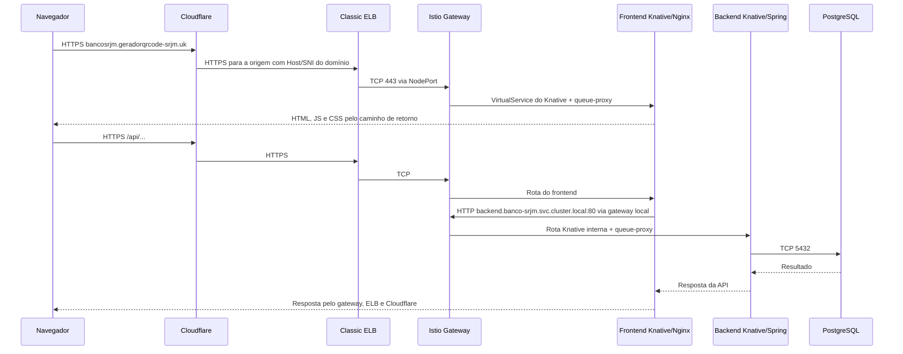

# Arquitetura e instalação do Banco SRJM

> Registro histórico: este documento descreve uma etapa anterior à limpeza atual. O inventário vigente está em [k8s/README.md](../k8s/README.md); o fluxo atual de Vault está em [Vault CLI](vault-cli.md).

> Atualização: foram preparados três charts independentes para banco, backend e frontend, preservando `k8s/`. Os pacotes, índice e instruções de adoção estão em [Helm e Argo CD](../helm/README.md). A consolidação abaixo descreve a etapa anterior.

Estado consultado em 11/09/2026, contexto Kubernetes `eks-new`, cluster AWS `srjm-eks-new`, região Ohio (`us-east-2`). Esta documentação distingue os recursos declarados no repositório dos componentes instalados pelos charts e dos recursos que os controllers geram automaticamente.

A aplicação é mantida por Kustomize em `k8s/`. Helm instala a plataforma. Na limpeza de duplicidades não foram reinstalados controllers, removidos recursos do cluster ou alterados templates das aplicações: os 36 recursos renderizados e sua ordem permaneceram idênticos.

## O que foi consolidado

Foram removidos 45 arquivos redundantes: o chart alternativo da aplicação, seis manifests convencionais de frontend/backend e Gateway/VirtualService e cinco values de exemplos que dependiam do fluxo antigo. Os arquivos de configuração copiados dentro do chart eram idênticos a `application.yaml` e `nginx-front/`, que permanecem no projeto.

Os seis Secrets locais usados na migração estão em `.secrets/manifestos-anteriores/`, com permissão 600 e fora do Git/apply. As credenciais ativas permanecem no Vault. Uma cópia protegida dos arquivos removidos foi guardada localmente em `/tmp/banco-manifestos-antes-da-consolidacao.tar.gz`; ela não faz parte do projeto.

`svc-postgress-head.yaml` passou a se chamar `svc-postgres-headless.yaml`. O nome Kubernetes continua `postgres-headless`. `overlays/knative` é apenas um alias da base e foi preservado.

## Quem faz o quê

| Componente | Responsabilidade | Como é mantido |
| --- | --- | --- |
| EKS, VPC, subnets e IAM | Cluster, rede e permissões AWS | Infraestrutura preexistente; não criada por estes YAMLs |
| EBS CSI | Provisionar discos pedidos pelos PVCs | Driver já instalado no EKS |
| AWS Load Balancer Controller | Gerenciar ALB/NLB quando selecionado | Helm, chart 3.5.0, namespace kube-system |
| Provedor AWS legado de Services | Provisionar este Classic ELB | Reage ao Service LoadBalancer sem classe |
| Istio base | CRDs do Istio | Helm, chart 1.31.0 |
| Istiod | Configurar os proxies e manter o injector do gateway | Helm, chart 1.31.0, namespace istio-system |
| Istio Gateway | Receber tráfego e executar rotas HTTP/TLS | Helm, chart gateway 1.31.0, release istio-ingress |
| Knative Operator | Instalar/reconciliar KnativeServing | Helm, chart 1.23.1 |
| Knative Serving e net-istio | Revisões, escala, rotas e integração com Istio | KnativeServing declarado em YAML; versão observada 1.23.0 |
| cert-manager | Emitir/renovar certificados públicos e internos | Helm, chart v1.21.1 |
| Vault | Armazenar credenciais no KV v2 | Helm, chart 0.34.1, Vault 2.0.4 |
| External Secrets Operator | Ler Vault e sincronizar Secrets Kubernetes | Helm, chart 2.10.0 |
| Frontend e backend | Interface e API | Services Knative em YAML |
| PostgreSQL | Banco persistente | StatefulSet, Services e PVC em YAML |
| Mailpit | Capturar e-mails de teste | Deployment e Service em YAML |

As releases acima foram verificadas com `helm list -A`. Argo CD e Karpenter também existem no cluster, mas a consulta não demonstra que façam a gestão desta aplicação; não foram alterados nesta tarefa.

## Como a plataforma foi instalada

Os comandos abaixo documentam as instalações observadas e como reproduzir seus parâmetros relevantes. Não são um histórico de shell da instalação original. As instalações antigas já existiam antes dos ajustes deste projeto. O Vault e o External Secrets foram instalados/recuperados e configurados durante a migração de credenciais.

A ordem para um ambiente novo é: EKS/rede/IAM e EBS CSI → AWS Controller/cert-manager → Istio → Knative Operator e KnativeServing → Vault e External Secrets → credenciais → aplicação e domínio. `kubectl apply -k k8s` sozinho não instala os charts nem inicializa o Vault.

### AWS Load Balancer Controller

A release usa `clusterName=srjm-eks-new`, região `us-east-2` e VPC `vpc-06c42b991809bb58d`. A ServiceAccount `kube-system/aws-load-balancer-controller` possui anotação IRSA apontando para a role `srjm-eks-new-load-balancer-controller`. Essa role e sua relação de confiança OIDC precisam existir com as permissões AWS adequadas; o chart não cria a role IAM.

O ajuste aplicado e preservado em `helm/values-aws-load-balancer-controller-classic.yaml` é `enableServiceMutatorWebhook: false`. Para manter a release existente:

```sh
helm repo add eks https://aws.github.io/eks-charts
helm --kube-context eks-new upgrade aws-load-balancer-controller eks/aws-load-balancer-controller \
  -n kube-system --version 3.5.0 --reuse-values \
  -f helm/values-aws-load-balancer-controller-classic.yaml --wait --timeout 5m
```

Em uma instalação inicial equivalente, com a role IAM já provisionada:

```sh
helm --kube-context eks-new upgrade --install aws-load-balancer-controller eks/aws-load-balancer-controller \
  -n kube-system --version 3.5.0 \
  --set clusterName=srjm-eks-new --set region=us-east-2 --set vpcId=vpc-06c42b991809bb58d \
  --set serviceAccount.create=true --set serviceAccount.name=aws-load-balancer-controller \
  --set 'serviceAccount.annotations.eks\.amazonaws\.com/role-arn=arn:aws:iam::739871967137:role/srjm-eks-new-load-balancer-controller' \
  -f helm/values-aws-load-balancer-controller-classic.yaml --wait --timeout 5m
```

A desativação do webhook permite ao provedor AWS legado assumir Services sem classe e criar Classic ELB. O AWS Load Balancer Controller continua instalado para os recursos que lhe são atribuídos. Essa seleção de controller é descrita na [documentação AWS](https://docs.aws.amazon.com/eks/latest/userguide/aws-load-balancer-controller.html).

### Istio

Foram detectadas três releases separadas: `istio-base`, `istiod` e `istio-ingress`. O chart gateway cria os pods do proxy; seu Service próprio fica em ClusterIP. A exposição pública pertence ao manifesto Classic ELB do projeto.

```sh
helm repo add istio https://istio-release.storage.googleapis.com/charts
helm --kube-context eks-new upgrade --install istio-base istio/base \
  -n istio-system --create-namespace --version 1.31.0 --wait
helm --kube-context eks-new upgrade --install istiod istio/istiod \
  -n istio-system --version 1.31.0 -f helm/values-istiod-eks.yaml --wait
helm --kube-context eks-new upgrade --install istio-ingress istio/gateway \
  -n istio-ingress --create-namespace --version 1.31.0 -f helm/values-istio-gateway-eks.yaml --wait
```

O comando usa o endereço público do repositório oficial; a máquina consultada já possuía o alias `istio` apontando para `https://blob.istio.io/istio-release/charts`.

Os values do Istiod reservam 100m CPU/512Mi. O injector do Istiod é usado pelo template do gateway. Os pods frontend/backend têm `sidecar.istio.io/inject: 'false'`: recebem o queue-proxy do Knative, mas não um sidecar Istio. Veja a [instalação Helm do Istio](https://istio.io/latest/docs/setup/install/helm/).

### Knative

O Operator foi instalado por Helm. O recurso `k8s/platform/knative-serving.yaml` habilita a integração Istio e configura os gateways externo e local. O Operator instala/reconcilia Serving e net-istio; os YAMLs desses controllers não precisam ser copiados para o repositório.

```sh
helm repo add knative-operator https://knative.github.io/operator
helm --kube-context eks-new upgrade --install knative-operator knative-operator/knative-operator \
  -n knative-operator --create-namespace --version 1.23.1 --wait
kubectl --context eks-new create namespace knative-serving --dry-run=client -o yaml | kubectl --context eks-new apply -f -
kubectl --context eks-new apply -k k8s/platform
kubectl --context eks-new -n knative-serving wait --for=condition=Ready knativeserving/knative-serving --timeout=600s
```

Frontend e backend são declarados com `apiVersion: serving.knative.dev/v1`, `kind: Service`. O Knative gera Configuration, Revision, Route, Deployments, Services de rede e os objetos de ingress necessários. Net-istio traduz o roteamento para Istio. Não mantenha VirtualServices ou Deployments paralelos para esses mesmos workloads. O [Operator](https://knative.dev/docs/install/operator/knative-with-operators/) e o [DomainMapping](https://knative.dev/docs/serving/services/custom-domains/) documentam essas integrações.

### cert-manager

A release detectada é `cert-manager`, chart v1.21.1. Um comando equivalente para instalar o controller e suas CRDs é:

```sh
helm repo add jetstack https://charts.jetstack.io
helm --kube-context eks-new upgrade --install cert-manager jetstack/cert-manager \
  -n cert-manager --create-namespace --version v1.21.1 --set crds.enabled=true --wait
```

Instale-o antes dos recursos `Issuer` e `Certificate`, inclusive os certificados internos do Vault. O [guia TLS](istio-letsencrypt.md) explica o DNS-01 e o uso do token Cloudflare.

### Vault e External Secrets

Primeiro foram aplicados os YAMLs de `k8s/vault/` para criar o namespace e os certificados TLS. Depois os charts oficiais foram instalados com `helm/values-vault-eks.yaml` e `helm/values-external-secrets.yaml`:

```sh
helm repo add hashicorp https://helm.releases.hashicorp.com
helm repo add external-secrets https://charts.external-secrets.io
kubectl --context eks-new apply -f k8s/storageclass.yaml
kubectl --context eks-new apply -k k8s/vault
kubectl --context eks-new -n vault wait --for=condition=Ready certificate/vault-ca certificate/vault-server --timeout=180s
helm --kube-context eks-new upgrade --install external-secrets external-secrets/external-secrets \
  -n external-secrets --create-namespace --version 2.10.0 -f helm/values-external-secrets.yaml --wait --timeout 5m
helm --kube-context eks-new upgrade --install vault hashicorp/vault \
  -n vault --version 0.34.1 -f helm/values-vault-eks.yaml --timeout 5m
kubectl --context eks-new -n vault wait --for=jsonpath='{.status.phase}'=Running pod/vault-0 --timeout=300s
python3 scripts/bootstrap-vault.py
kubectl --context eks-new apply -k k8s/external-secrets
kubectl --context eks-new wait --for=condition=Ready clustersecretstore/vault-banco clustersecretstore/vault-cert-manager --timeout=180s
kubectl --context eks-new -n banco-srjm wait --for=condition=Ready externalsecret --all --timeout=180s
kubectl --context eks-new -n cert-manager wait --for=condition=Ready externalsecret/cloudflare-api-token-secret --timeout=180s
python3 scripts/bootstrap-vault.py --verify-and-finalize
```

O bootstrap usa os seis Secrets já existentes como origem da migração. Em um cluster novo, provisione primeiro as credenciais iniciais e o namespace da aplicação. O script inicializa o Vault uma vez, habilita KV v2 e autenticação Kubernetes, configura políticas e copia os dados sem imprimir valores. A finalização verifica igualdade e bloqueio de acesso cruzado e revoga o token root.

Os dois ClusterSecretStores possuem identidades e políticas distintas. `vault-banco` só admite consumidores em `banco-srjm`; `vault-cert-manager`, em `cert-manager`. Seis ExternalSecrets consultam os caminhos do Vault a cada minuto e mantêm os Secrets Kubernetes existentes. Os dois placeholders de frontend/Mailpit foram preservados na migração; atualmente não contêm credenciais usadas pelos workloads.

O Vault não é exposto pelo ELB e não participa das requisições HTTP da aplicação. Ele tem TLS interno, Raft em PVC gp3 de 5 GiB e uma réplica. Após reinício, precisa de unseal manual. Duas das três chaves de `.secrets/vault-init.json` são necessárias; mantenha backup protegido. Consulte [recuperação e administração](vault-external-secrets.md).

## Como o Classic ELB foi criado

O arquivo `k8s/platform/istio-ingress-classic.yaml` declara um Service `LoadBalancer` em `istio-ingress`. Ele possui portas 80/443, backend TCP e selector `app: istio-ingress`, `istio: ingress`. Não possui classe NLB, anotação NLB ou IDs de subnets.

Ao aplicar esse Service, o provedor AWS legado criou o Classic ELB público. A descoberta automática escolheu duas subnets elegíveis da VPC. As subnets públicas devem ter rota ao Internet Gateway e identificação adequada; o fato de os nodes serem públicos não garante sozinho o provisionamento. Os detalhes estão no [guia AWS](istio-aws-classic.md).

A consulta à API `aws elb describe-load-balancers` confirmou:

| Entrada do Classic ELB | Destino no nó EKS | Depois |
| --- | --- | --- |
| TCP 80 | NodePort 31516 | Gateway Istio, porta 80 |
| TCP 443 | NodePort 31893 | Gateway Istio, porta 443 |

Os NodePorts acima são os atuais, alocados pelo Kubernetes. O TLS termina no Istio; o Classic transporta a conexão TCP e não armazena o certificado da aplicação.

```sh
kubectl --context eks-new apply -f k8s/platform/istio-ingress-classic.yaml
kubectl --context eks-new -n istio-ingress get svc istio-ingress-classic \
  -o jsonpath='{.status.loadBalancer.ingress[0].hostname}{"\n"}'
```

Hostname atual:

```text
ad9260bd1a3f64eeea48e9dcd11746af-1296708679.us-east-2.elb.amazonaws.com
```

Existem três Services para os mesmos pods: o ClusterIP pertencente ao chart, o Classic externo e `knative-local-gateway` interno. O último usa 80 → 8081 e 443 → 8444. Eles têm funções diferentes e foram mantidos.

## Comunicação com a Cloudflare e a aplicação

Na zona `geradorqrcode-srjm.uk`, o CNAME `bancosrjm` deve apontar para o hostname do Classic ELB. Com proxy ativado, o navegador recebe endereços Cloudflare. O teste público retornou HTTP 200, `server: cloudflare` e `cf-ray`, confirmando que o tráfego passa pelo proxy; não foi consultado o painel para comprovar o modo SSL/TLS selecionado.



O DomainMapping liga o domínio ao frontend. O Istio usa os VirtualServices gerados pelo Knative para encontrar a revisão correta. O frontend entrega os arquivos da interface e encaminha `/api/` para o backend usando DNS e Host internos. O backend tem visibilidade `cluster-local`; não precisa de outro ELB ou registro Cloudflare. PostgreSQL e Mailpit também são internos.

Configure Cloudflare Full (strict): navegador ↔ Cloudflare tem TLS e Cloudflare ↔ Istio também, com validação do certificado da origem. O tráfego HTTP da aplicação dentro do cluster não usa mTLS neste perfil. Veja [Full (strict)](https://developers.cloudflare.com/ssl/origin-configuration/ssl-modes/full-strict/).

Em paralelo, cert-manager usa o token Cloudflare sincronizado do Vault para criar/remover TXT de DNS-01 e renovar o certificado Let's Encrypt. Esse token não encaminha requisições e não cria o CNAME da aplicação neste projeto.

Abrir apenas o hostname AWS no navegador não é um teste completo: as rotas e o certificado são do domínio `bancosrjm.geradorqrcode-srjm.uk`. Para testar a origem diretamente, preservando Host e SNI:

```sh
curl --noproxy '*' \
  --connect-to bancosrjm.geradorqrcode-srjm.uk:443:ad9260bd1a3f64eeea48e9dcd11746af-1296708679.us-east-2.elb.amazonaws.com:443 \
  https://bancosrjm.geradorqrcode-srjm.uk/api/actuator/health
```

## Recursos gerados automaticamente

Além dos 36 objetos declarados, os controllers criam outros necessários: pods e Deployments de revisão, Services Knative, rotas Istio, Secrets sincronizados, Secrets TLS/chave ACME, CertificateRequests, PVC/PV e o balanceador AWS. Esses objetos não devem ser copiados como novos manifests da aplicação. O StatefulSet declara o template do PVC PostgreSQL; o chart Vault declara o seu armazenamento.

## Inventário dos YAMLs

Todos os arquivos abaixo são relativos a `k8s/`. Cada um contém um recurso. Os Kustomizations apenas os incluem na [ordem FIFO](../k8s/README.md).

| Manifesto | Recurso | Função |
| --- | --- | --- |
| [namespace.yaml](../k8s/namespace.yaml) | Namespace | Namespace da aplicação, sem injeção de sidecar Istio. |
| [vault/namespace.yaml](../k8s/vault/namespace.yaml) | Namespace | Namespace Vault sem injeção Istio. |
| [vault/selfsigned-issuer.yaml](../k8s/vault/selfsigned-issuer.yaml) | Issuer | Issuer inicial usado para emitir a CA interna. |
| [vault/ca-certificate.yaml](../k8s/vault/ca-certificate.yaml) | Certificate | Certificado da CA interna e seu Secret, gerados pelo cert-manager. |
| [vault/ca-issuer.yaml](../k8s/vault/ca-issuer.yaml) | Issuer | Issuer que usa a CA interna para emitir o certificado do servidor Vault. |
| [vault/server-certificate.yaml](../k8s/vault/server-certificate.yaml) | Certificate | Certificado TLS dos nomes DNS internos do Vault. |
| [vault/admin-serviceaccount.yaml](../k8s/vault/admin-serviceaccount.yaml) | ServiceAccount | Identidade Kubernetes para administrar os caminhos de credenciais no Vault. |
| [platform/istio-ingress-classic.yaml](../k8s/platform/istio-ingress-classic.yaml) | Service | Service LoadBalancer que solicita o Classic ELB. |
| [platform/knative-local-gateway.yaml](../k8s/platform/knative-local-gateway.yaml) | Service | Service ClusterIP para o gateway de rotas internas Knative. |
| [platform/knative-serving.yaml](../k8s/platform/knative-serving.yaml) | KnativeServing | KnativeServing reconciliado pelo Operator, com net-istio e selectors dos gateways. |
| [storageclass.yaml](../k8s/storageclass.yaml) | StorageClass | Classe EBS gp3 criptografada, Retain e provisionamento pelo EBS CSI. |
| [postgres-config.yaml](../k8s/postgres-config.yaml) | ConfigMap | ConfigMap com nome do banco, usuário e diretório de dados. |
| [backend-config.yaml](../k8s/backend-config.yaml) | ConfigMap | ConfigMap com parâmetros comuns da API. |
| [frontend-nginx.yaml](../k8s/frontend-nginx.yaml) | ConfigMap | ConfigMap com nginx.conf e nginx-main.conf montados no frontend. |
| [external-secrets/vault-ca.yaml](../k8s/external-secrets/vault-ca.yaml) | ConfigMap | ConfigMap da CA pública usada pelo ESO para validar o servidor Vault. |
| [external-secrets/vault-banco-reader.yaml](../k8s/external-secrets/vault-banco-reader.yaml) | ServiceAccount | ServiceAccount para autenticar a leitura das credenciais da aplicação. |
| [external-secrets/cluster-store-banco.yaml](../k8s/external-secrets/cluster-store-banco.yaml) | ClusterSecretStore | ClusterSecretStore permitido em banco-srjm. |
| [external-secrets/vault-cert-manager-reader.yaml](../k8s/external-secrets/vault-cert-manager-reader.yaml) | ServiceAccount | ServiceAccount para autenticar a leitura do token Cloudflare. |
| [external-secrets/cluster-store-cert-manager.yaml](../k8s/external-secrets/cluster-store-cert-manager.yaml) | ClusterSecretStore | ClusterSecretStore permitido em cert-manager. |
| [external-secrets/postgres-secret.yaml](../k8s/external-secrets/postgres-secret.yaml) | ExternalSecret | Sincroniza a senha compartilhada por PostgreSQL e backend. |
| [external-secrets/backend-secret.yaml](../k8s/external-secrets/backend-secret.yaml) | ExternalSecret | Sincroniza variáveis sensíveis do backend. |
| [external-secrets/backend-application.yaml](../k8s/external-secrets/backend-application.yaml) | ExternalSecret | Sincroniza o arquivo application.yaml montado pelo backend. |
| [external-secrets/cloudflare-api-token-secret.yaml](../k8s/external-secrets/cloudflare-api-token-secret.yaml) | ExternalSecret | Sincroniza o token DNS-01 no namespace cert-manager. |
| [letsencrypt-production.yaml](../k8s/letsencrypt-production.yaml) | ClusterIssuer | ClusterIssuer ACME com solver DNS-01 Cloudflare. |
| [svc-postgres.yaml](../k8s/svc-postgres.yaml) | Service | Service para clientes acessarem PostgreSQL na porta 5432. |
| [svc-postgres-headless.yaml](../k8s/svc-postgres-headless.yaml) | Service | Service headless para a identidade de rede do StatefulSet. |
| [svc-mailpit.yaml](../k8s/svc-mailpit.yaml) | Service | Service interno SMTP 1025 e interface 8025. |
| [postgres.yaml](../k8s/postgres.yaml) | StatefulSet | StatefulSet PostgreSQL, uma réplica e template de PVC de 20 GiB. |
| [mailpit.yaml](../k8s/mailpit.yaml) | Deployment | Deployment SMTP de testes, fora do Knative. |
| [certificate.yaml](../k8s/certificate.yaml) | Certificate | Certificate do domínio, gerando o Secret banco-srjm-tls. |
| [backend.yaml](../k8s/backend.yaml) | Service | Service Knative da API Spring, cluster-local; lê configuração e Secrets. |
| [frontend.yaml](../k8s/frontend.yaml) | Service | Service Knative do Nginx; entrega a interface e encaminha /api/. |
| [cluster-domain-claim.yaml](../k8s/cluster-domain-claim.yaml) | ClusterDomainClaim | Reserva o domínio para banco-srjm no Knative. |
| [domain-mapping.yaml](../k8s/domain-mapping.yaml) | DomainMapping | Associa o domínio público ao frontend e ao Secret TLS. |

## Recuperação observada durante a revisão

Na verificação final, o pod Vault havia sido recriado e estava selado, causando HTTP 503 nas consultas dos stores. Foi executado `python3 scripts/bootstrap-vault.py --unseal` com as chaves locais e solicitada nova reconciliação. Isso é independente da limpeza de arquivos: a renderização da aplicação permaneceu igual. Esta instalação continua com unseal manual após reinício; a limpeza não adicionou auto-unseal.

## Resultado da validação

Após o desbloqueio, os dois ClusterSecretStores e os seis ExternalSecrets voltaram a Ready. O script verificou a igualdade dos valores sincronizados e confirmou HTTP 403 para tentativas de leitura entre as duas políticas. O token root continua revogado.

O frontend respondeu HTTPS 200 e `/api/actuator/health` respondeu 200 com `status: UP`. Backend `00003` e frontend `00002` estavam Ready, assim como DomainMapping e Certificate. Os dois nós registrados no Classic ELB estavam InService e os PVCs PostgreSQL/Vault permaneceram preservados.

```sh
python3 scripts/validate-manifests.py
kubectl --context eks-new apply --dry-run=server -k k8s
kubectl --context eks-new get clustersecretstores
kubectl --context eks-new get externalsecrets -A
kubectl --context eks-new -n banco-srjm get ksvc,domainmapping,certificate,pvc
aws elb describe-instance-health --region us-east-2 --load-balancer-name ad9260bd1a3f64eeea48e9dcd11746af
curl -I https://bancosrjm.geradorqrcode-srjm.uk/
curl https://bancosrjm.geradorqrcode-srjm.uk/api/actuator/health
```

O dry-run dos 36 recursos foi aceito pelo servidor. Alguns aparecem como `configured` porque existem diferenças anteriores à limpeza entre os arquivos e o estado vivo; nenhum apply completo foi executado nesta etapa. A comparação local antes/depois da limpeza é que comprovou a preservação exata dos manifests.
