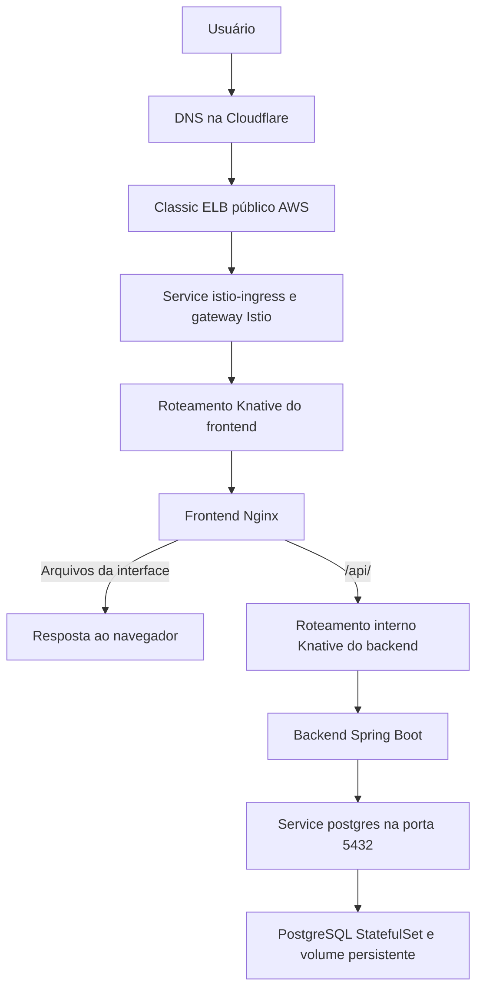

# Knative no Banco SRJM

Esta pasta contém os manifestos da aplicação usando **Knative Serving** para
frontend e backend. O Istio recebe e encaminha as requisições, enquanto o
PostgreSQL roda como um StatefulSet do Kubernetes, com armazenamento persistente.

Este documento descreve a configuração dos manifestos. A existência dos arquivos
não confirma que os recursos estejam aplicados ou prontos no cluster.

## O que o Knative gerencia

O Knative Serving executa aplicações em containers sobre Kubernetes e gerencia
suas versões, rotas e escala automática conforme a demanda.

| Recurso Knative | Função |
| --- | --- |
| Service | Declara a aplicação e coordena seu ciclo de vida |
| Configuration | Define o template de execução da aplicação |
| Revision | Representa uma versão imutável do container e da configuração |
| Route | Distribui requisições entre as revisões |

Uma alteração no template da aplicação gera uma nova revisão. É possível
distribuir tráfego entre revisões para fazer uma atualização gradual.

O Knative gerencia recursos Kubernetes para executar essas revisões. Nos pods,
o container `queue-proxy` participa do encaminhamento, das métricas e do controle
de concorrência. O componente Activator pode aguardar requisições enquanto uma
revisão inicia e ajudar a absorver picos; ele não participa obrigatoriamente de
toda requisição.

## Service Knative e Service Kubernetes

Apesar de ambos usarem `kind: Service`, são recursos diferentes:

| API | Responsabilidade |
| --- | --- |
| `serving.knative.dev/v1` | Gerenciar uma aplicação, suas revisões, rotas e escala |
| `v1` | Fornecer acesso de rede a workloads Kubernetes |

[backend.yaml](backend.yaml) e [frontend.yaml](frontend.yaml) declaram Services
Knative. Seus Services internos são gerenciados pelo Knative, portanto não se
deve aplicar os Services manuais de [legacy/svc-backend.yaml](legacy/svc-backend.yaml)
e [legacy/svc-frontend.yaml](legacy/svc-frontend.yaml) junto dessa configuração.
Esses arquivos legados não são referenciados pelo [kustomization.yaml](kustomization.yaml).

Remover um arquivo legado do repositório é diferente de excluir um recurso do
cluster. Não exclua Services existentes de frontend/backend sem verificar seus
`ownerReferences`: eles podem estar sob gerenciamento do Knative.

## Fluxo das requisições

Fluxo lógico simplificado, após provisionar a entrada pública e configurar o DNS:



Em [frontend-nginx.yaml](frontend-nginx.yaml), o Nginx entrega a interface e
encaminha `/api/` para:

```text
http://backend.banco-srjm.svc.cluster.local:80
```

O cabeçalho `Host` também é definido como
`backend.banco-srjm.svc.cluster.local` para identificar a rota interna.
A porta 80 é a entrada de rede interna; o processo da aplicação escuta na porta
8080 do container.

O backend possui o label `networking.knative.dev/visibility: cluster-local`,
configurando sua rota Knative para acesso interno ao cluster. O navegador acessa
a API pelo frontend, que faz o encaminhamento.

## Escala das aplicações

Os manifestos desta pasta definem:

| Configuração | Frontend | Backend |
| --- | --- | --- |
| `autoscaling.knative.dev/min-scale` | 1 | 1 |
| `autoscaling.knative.dev/max-scale` | 3 | 3 |
| `containerConcurrency` | 80 | 20 |
| Porta do container | 8080 | 8080 |
| `timeoutSeconds` | 300 | 300 |

Os limites de escala são por revisão. Com mínimo 1, as revisões ativas não
escalam a zero por inatividade. Isso evita a espera de inicialização após um
período sem tráfego, mas mantém recursos alocados.

`containerConcurrency: 20` limita a 20 requisições simultâneas por réplica do
backend. Não significa 20 usuários nem 20 requisições por segundo. O autoscaler
usa métricas e metas de utilização e pode escalar antes de alcançar esse limite.
O Knative ajusta pods; a capacidade dos nodes do EKS depende da configuração de
infraestrutura do cluster.

O timeout Knative é apenas um dos limites no caminho: o Nginx deste projeto
também define `proxy_read_timeout 60s` para as chamadas à API.

## Domínio e HTTPS

[certificate.yaml](certificate.yaml), [cluster-domain-claim.yaml](cluster-domain-claim.yaml) e [domain-mapping.yaml](domain-mapping.yaml) configura:

- `Certificate`: solicita o certificado pelo cert-manager usando o ClusterIssuer
  `letsencrypt-production`.
- `ClusterDomainClaim`: associa o domínio ao namespace `banco-srjm`.
- `DomainMapping`: direciona `bancosrjm.geradorqrcode-srjm.uk` ao Service Knative
  `frontend` e referencia o Secret TLS `banco-srjm-tls`.

O DNS público deve apontar para o endereço externo provisionado para o ingress.
Um Service com endereço externo `<pending>` ainda não fornece o destino para
esse registro DNS. A configuração do domínio e a emissão do certificado devem
ser verificadas separadamente no cluster.

## Istio e Classic ELB

O gateway Istio é separado das aplicações Knative. O manifesto
[istio-ingress-classic.yaml](platform/istio-ingress-classic.yaml) expõe seus pods por
Classic ELB, com descoberta automática das subnets públicas. Ele é incluído por `platform/kustomization.yaml` e pelo Kustomization principal,
após configurar o controller conforme o
[guia AWS](../docs/istio-aws-classic.md).

O Service usa o namespace `istio-ingress` e o selector `istio: ingress` junto
com `app: istio-ingress`. O recurso Gateway de roteamento não cria o ELB por si só.
No fluxo Knative, o domínio é declarado no DomainMapping. Os manifests manuais
[legacy/istio.yaml](legacy/istio.yaml) e [legacy/Istio-vs.yaml](legacy/Istio-vs.yaml)
pertencem ao modo convencional e ficam fora do Kustomization.

## PostgreSQL

O banco permanece fora do Knative e usa [postgres.yaml](postgres.yaml), com
StatefulSet e volume persistente. Os dois Services Kubernetes devem ser mantidos:

| Manifesto | Função |
| --- | --- |
| [svc-postgres.yaml](svc-postgres.yaml) | Acesso interno ao banco pela porta 5432 |
| [svc-postgress-head.yaml](svc-postgress-head.yaml) | Service headless referenciado pelo StatefulSet para identidade de rede |

O endereço disponível é `postgres.banco-srjm.svc.cluster.local:5432`.
O backend recebe sua URL de conexão por `DB_URL`, via Secret; essa configuração
deve apontar para o banco correto. Nenhum desses Services precisa de NLB ou DNS
público na Cloudflare.

## Verificação no cluster

Execute os comandos no contexto Kubernetes do cluster desejado:

```bash
# Confirmar o contexto antes das consultas
kubectl config current-context

# Aplicações Knative, URLs e condição Ready
kubectl -n banco-srjm get ksvc

# Versões, configurações e rotas
kubectl -n banco-srjm get revisions
kubectl -n banco-srjm get configurations,routes

# Recursos Kubernetes, incluindo os gerenciados pelo Knative
kubectl -n banco-srjm get pods,svc

# Domínio e certificado
kubectl -n banco-srjm get domainmappings,certificates

# Componentes e entrada do Istio
kubectl -n istio-ingress get deployments,pods,svc
kubectl -n istio-ingress describe svc istio-ingress-classic

# Obter o hostname do Classic ELB, quando disponível
kubectl -n istio-ingress get svc istio-ingress-classic \
  -o jsonpath='{.status.loadBalancer.ingress[0].hostname}{"\n"}'
```

`kubectl get ksvc` consulta aplicações Knative. `kubectl get svc` consulta
Services de rede do Kubernetes. Ambos podem existir para a mesma aplicação.

## Referências

- [Knative Serving: visão geral](https://knative.dev/docs/serving/)
- [Arquitetura do Knative](https://knative.dev/docs/serving/architecture/)
- [Autoscaling](https://knative.dev/docs/serving/autoscaling/)
- [Limites de escala](https://knative.dev/docs/serving/autoscaling/scale-bounds/)
- [Concorrência](https://knative.dev/docs/serving/autoscaling/concurrency/)
- [AWS Load Balancer Controller](https://kubernetes-sigs.github.io/aws-load-balancer-controller/latest/how-it-works/)
